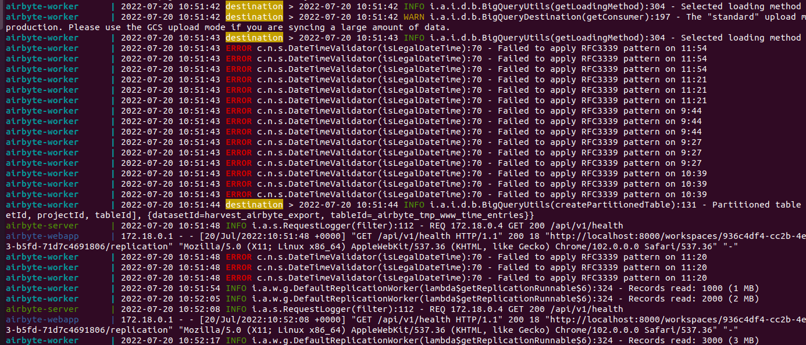
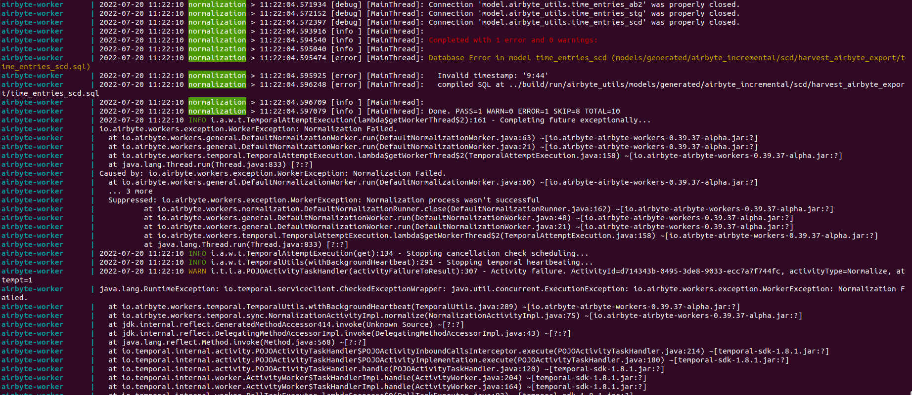

# harvest-export-custom-transformation

This repository contains the definition of a Custom DBT transformation
that is used to transform Raw Harvest JSON data into a BigQuery table.
We want to be able to use the Harvest data for analytics.

## The problem using Airbyte connectors

At the beginning everything looks rather fine. The data from Harvest is being read and a temporary table with all the RAW
data is being created.

Airbyte has a mechanism for [Normalization](https://docs.airbyte.com/understanding-airbyte/basic-normalization/)
We wanted to use it so that all the data would be normalized.
Separated into coresponding tables but we encountered the problem with Harvest Connector.

The records would be stored in BigQuery in a temporary table, but then the export would fail.

There were errors in transformation of Timestamps. [This](https://github.com/airbytehq/airbyte/labels/connectors%2Fsource%2Fharvest)
is a known issue with Harvest Connector and we should track it.

In the meantime when there is no other solution to the problem we created a custom DBT transformation that reads data from JSONs stored on BigQuery and
we transform the data so that it is stored as an internal BigQuery table with useful columns.

## SETUP

We are using an instance of [Airbyte running on Docker](https://docs.airbyte.com/quickstart/deploy-airbyte/):
For now the instance is running locally, on my Laptop.

GCP Service Account and a [Harvest Personal Authentication Token](https://id.getharvest.com/developers) had to be
prepared to give access to Harvest data and to store data on BigQuery table.

## The exported data

The data is being exported into a BigQuery table.
Here is the [link](https://console.cloud.google.com/bigquery?project=harvest-351907&ws=!1m5!1m4!4m3!1sharvest-351907!2sharvest_airbyte_export) to BigQuery.
